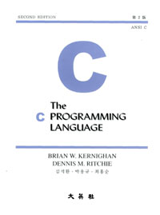

# The C PROGRAMMING LANGUAGE

  

#### 본 repository는 github 및 markdown 사용 숙달과 더불어 그동안 공부한 내용들을 게시하기 위한 목적으로 생성되었으며, 게시된 내용들에 오류가 있거나 다소 주관적일 수 있음. 
* [제1장 A Tutorial Introduction](./chapter1)
* [제2장 Types, Operators, and Expressions](./chapter2)
* [제3장 Control Flow](./chapter3)
* [제4장 Functions and Program Structure](./chapter4)
* [제5장 Pointers and Arrays](./chapter5)
* [제6장 Structures](./chapter6)
* [제7장 Input and Output](./chapter7)
* [제8장 The UNIX System Interface](./chapter8)
* [부록 A. Reference Manual](./referenceA)
* [부록 B. Standard Library](./referenceB)
* [부록 C. Summary of Changes](./referenceC)
* [Index](./index)
